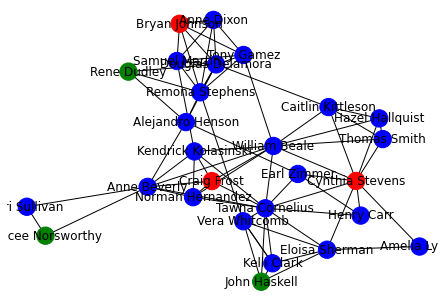

# Objective

Case-study to show how network (or graph) analysis could help organisation of events.

# Case-study

## Datasets

### Participant Table

Primary key: `ParticipantId`

|ParticipantId|ParticipantName|ParticipantAge|ParticipantRace|
|---|---|---|---|
|1|Aaron|27|Chinese|
|2|Bel|28|Malay|
|3|Charlie|48|Indian|
|4|Danielle|49|Others|

### Event Table

Primary key: `EventId`

|EventId|EventType|EventDate|EventName|
|---|---|---|---|
|1|Sporty|1-Jan-2021|Empty Stadium Football Game|
|2|Charity|10-Dec-2020|Covid Be Gone|
|3|Musical|5-Jun-2019|Song of Life|

### Event Attendance

Primary key: `EventId` + `ParticipantId`

|EventId|ParticipantId|
|---|---|
|1|1|
|1|2|
|2|3|

## Business Case

You are in the midst of organising another event. A few participants were enthusiastic, and had already signed up.

Your Agency would like to be more deliberate with attendees, so as to encourage better interactions. Specifically, it would be best if (a) remaining participants had not met participants who had already signed up, and (b) remaining participants had somethign in common with participants who had already signed up.

To elaborate on (b), it would be nice if people who haven't met each other could see each other, and say: "Hey, do you know Person XXX?" "Ya, I do know!" Not unlike how social media platforms recommend friends to us.

## Analytics Attack Plan

Use a network, since this captures social relationships. To achieve this, generate pairwise combinations of individuals who have attended the same event, and model them as a network.

Then, use metrics like [Jaccard coefficient](https://www.statisticshowto.com/jaccard-index/) to prioritise candidates to invite to the event.

# Concluding remarks

1. Data organisation is key. Tables for events and participants need to be present and clean, in the first place.
2. Running production-grade network analytics is hard, but doable.
3. Predictions should be ground-truthed. Just because Jaccard coefficient scores says they are good candidates, doesn't mean that they actually would enjoy each other's company.

DSAID has some experience in all the above! We've built and are building production-grade systems with Agencies in our Public Service. So if you wanna chat about network analytics, reach out to <ng_jing_song@tech.gov.sg> or <jingsong@dsaid.gov.sg> (author of this repo). He can point you to relevant folks.